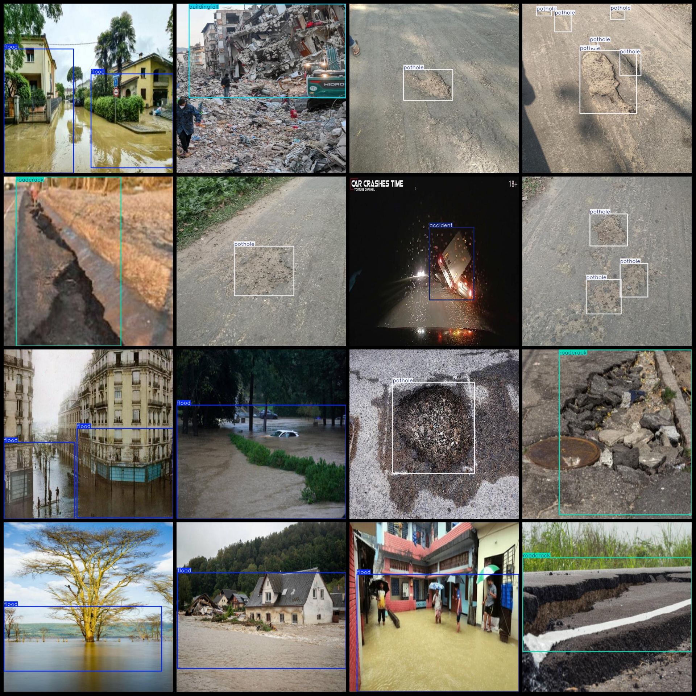
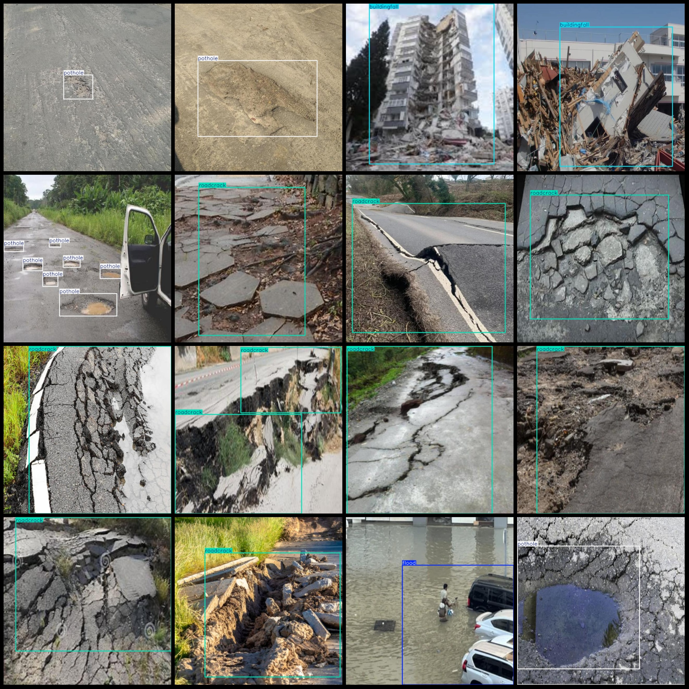

# Road Traffic Accidents, Pits and Cracks, Building Collapses Detection Dataset in VOC+YOLO Format with 3767 Images in 5 Categories

Dataset Format: Pascal VOC format + YOLO format (txt file without segmentation paths, only containing jpg images and corresponding VOC format xml files and YOLO format txt files).
Number of Images: 3767
Number of Annotations: 3767
Number of Annotations in XML Files: 3767
Number of Annotations in TXT Files: 3767
Number of Annotation Categories: 5
Annotation Category Names (Note that the order of categories in the YOLO format may not correspond to this, but is based on the labels folder's classes.txt): ["accident", "buildingfall", "flood", 
"pothole", "roadcrack"]
Number of Boxes per Category:
- accident (accident) = 184
- buildingfall (buildingfall) = 1045
- flood (flood) = 1122
- pothole (pothole) = 1735
- roadcrack (roadcrack) = 1090
Total Boxes: 5176
Number of Images per Category:
- accident (accident) = 174
- buildingfall (buildingfall) = 966
- flood (flood) = 969
- pothole (pothole) = 661
- roadcrack (roadcrack) = 997
Image Resolution: 640x640
Annotation Tool Used: labelImg
Annotation Rules: Draw a box around the category
Important Notice: The dataset does not have a division of training, validation, or test sets; you will need to divide it yourself.
Special Remark: This dataset does not guarantee any accuracy for models trained on it or weight files.
Picture Preview:
Annotation Example:

Image

Here is a pay link on Stripe ( https://buy.stripe.com/3cs8yP7sY87d0vu9AB ). Please contact me lonlonago@foxmail.com after funding $89, and I will send you a complete data files , thank you!

